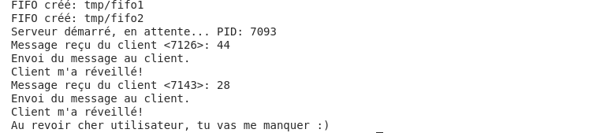
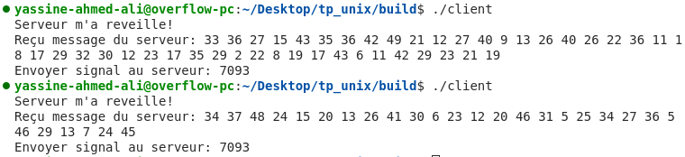

# TP UNIX

**Nom :** Mohamed Yassine Ahmed Ali & Dhiee Hmam  
**Classe :** 2ING GR 02  

---

## Description de l'Application

Application client-serveur en C utilisant des tubes FIFO et des signaux pour la communication et la synchronisation, avec tests unitaires pour assurer la stabilité des échanges de données.

---

## Structure du Projet

Le projet est organisé en plusieurs répertoires et fichiers sources pour plus de clarté et de modularité :

- **src** : Contient les fichiers sources principaux (`src_cli_fifo.c`, `Handlers_Serv.c`, `utils.c`, `server.c`, `client.c`).
- **include** : Contient les fichiers d'en-tête pour les déclarations de fonctions.
- **test** : Contient les fichiers pour les tests unitaires, incluant le fichier de test Unity (`unity.c`) et les tests spécifiques (`tests.c`).
- **build** : Répertoire de compilation pour les fichiers objets et exécutables.

---

## Fonctionnement du Serveur

Le serveur exécute les étapes suivantes :
1. Création de deux tubes FIFO : un pour recevoir les messages du client (`FIFO1`) et un autre pour envoyer les réponses (`FIFO2`).
2. Attente de réception d'un message du client via `FIFO1`.
3. Génération d'une séquence de nombres aléatoires et envoi de cette séquence au client via `FIFO2`.
4. Utilisation de signaux pour réveiller le client ou se terminer proprement (SIGUSR1 pour réveiller et SIGINT pour terminer).

---

## Fonctionnement du Client

Le client suit les étapes suivantes :
1. Génération d'un nombre aléatoire et envoi au serveur via `FIFO1`.
2. Attente de la réponse du serveur via `FIFO2`.
3. Envoi d'un signal SIGUSR1 au serveur pour indiquer la fin de traitement ou permettre sa terminaison.

---

## Utilisation des Signaux

Les signaux sont utilisés pour synchroniser les processus :
- Le client envoie un signal SIGUSR1 pour indiquer au serveur de traiter une demande.
- Le serveur renvoie un signal SIGUSR1 après avoir répondu pour informer le client que le traitement est terminé.

---

## Tests Unitaires

Les tests unitaires sont réalisés avec la bibliothèque **Unity** pour garantir la stabilité de l'application. Voici les tests principaux :

### 1. Test de la Création de FIFO
Test de `create_fifo` pour vérifier que le FIFO est correctement créé.

```c
void test_create_fifo(void) {
    const char* test_fifo = "/tmp/test_fifo";
    create_fifo(test_fifo);
    TEST_ASSERT_EQUAL(0, access(test_fifo, F_OK));
    close_fifo(test_fifo);
}
```

### 2. Test d'Écriture et de Lecture dans un FIFO
Test des fonctions `write_fifo` et `read_fifo` pour valider l'envoi et la réception de messages.

```c
void* reader_thread(void* arg) { /* Code de lecture */ }
void* writer_thread(void* arg) { /* Code d'écriture */ }

void test_write_and_read_fifo(void) {
    create_fifo(FIFO1);
    pthread_create(&reader_thread_id, NULL, reader_thread, NULL);
    pthread_create(&writer_thread_id, NULL, writer_thread, NULL);
    pthread_join(reader_thread_id, NULL);
    pthread_join(writer_thread_id, NULL);
    close_fifo(FIFO1);
}
```

### 3. Test de Génération de Nombres Aléatoires
Test de `generate_random_number` pour s'assurer que le nombre généré est dans l'intervalle attendu.

```c
void test_generate_random_number(void) {
  char *random_num = generate_random_number();
  TEST_ASSERT_NOT_NULL(random_num);
  int num = atoi(random_num);
  TEST_ASSERT_TRUE(num >= 1 && num < MAX);
  free(random_num);
}

```

### 4. Test de Génération de Séquences de Nombres Aléatoires
Test de `generate_random_number_sequence` pour vérifier la génération correcte de séquences.

```c
void test_generate_random_number_sequence(void) {
  char *sequence = generate_random_number_sequence("5");
  TEST_ASSERT_NOT_NULL(sequence);

  int count = 0;
  for (char *token = strtok(sequence, " "); token != NULL;
       token = strtok(NULL, " ")) {
    int num = atoi(token);
    TEST_ASSERT_TRUE(num >= 1 && num < MAX);
    count++;
  }
  TEST_ASSERT_EQUAL(5, count);
  free(sequence);
}
```

---

## Execution de l'application

### Serveur:




### Clients:




<br><br><br>


## Conclusion

Le programme implémente une communication client-serveur utilisant des tubes FIFO et des signaux pour gérer la synchronisation des processus. Les tests unitaires assurent la fiabilité de l'application en validant les fonctionnalités essentielles.